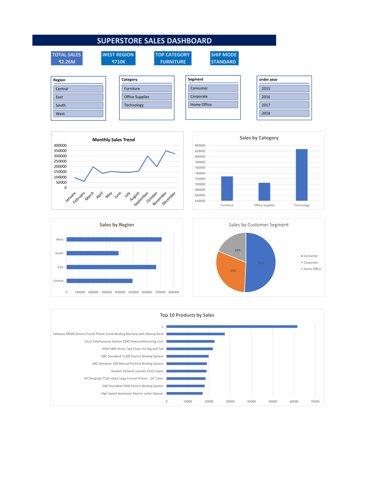

# 📊 Superstore Sales Dashboard (Microsoft Excel)



## 📌 Project Overview

This project analyzes the Sample Superstore retail dataset using Microsoft Excel. An interactive dashboard was created using Pivot Tables, Pivot Charts, KPI Cards, and Slicers to visualize sales performance across different business dimensions.

---

## 🎯 Objectives

- Analyze overall sales performance
- Identify top-performing regions and product categories
- Study monthly sales trends
- Compare customer segments
- Find top-selling products
- Build an interactive Excel dashboard

---

## 🛠 Tools Used

- Microsoft Excel
- Pivot Tables
- Pivot Charts
- Slicers
- Data Cleaning
- Conditional Formatting
- Data Visualization

---

## 📂 Dataset

- **Dataset:** Sample Superstore
- **Records:** 9,800
- **Columns:** 18

---

## 📈 Dashboard Features

- 📌 Total Sales KPI
- 🌍 Top Sales Region
- 🪑 Top Product Category
- 🚚 Most Used Shipping Mode
- 📅 Monthly Sales Trend
- 📊 Sales by Category
- 🌎 Sales by Region
- 👥 Sales by Customer Segment
- ⭐ Top 10 Products by Sales
- 🎛 Interactive Slicers (Region, Category, Segment, Order Year)

---

## 💡 Key Business Insights

- The West region generated the highest sales.
- Technology was the highest revenue-generating product category.
- Consumer customers contributed the largest share of total sales.
- Standard Class was the most frequently used shipping mode.
- Sales peaked during November and December.
- The dashboard supports interactive filtering using slicers.

---

## 🖼 Dashboard Preview


---

## 📊 Dashboard KPIs

| KPI | Value |
|------|------:|
| Total Sales | ₹2.26M |
| Top Region | West |
| Top Category | Technology |
| Most Used Ship Mode | Standard Class |

---

## 📊 Dataset Summary

| Metric | Value |
|---------|------:|
| Records | 9,800 |
| Columns | 18 |
| Dashboard Pages | 1 |
| KPI Cards | 4 |
| Charts | 5 |
| Slicers | 4 |

---

## 📁 Project Structure

```text
Superstore-Sales-Dashboard/
│
├── Dashboard/
│   ├── Superstore_Sales_Dashboard.xlsx
│   └── Superstore_Sales_Dashboard.pdf
│
├── Dataset/
│   └── SampleSuperstore.csv
│
├── Images/
│   └── Dashboard.png
│
├── README.md
│
└── LICENSE
```

---

## 🚀 Skills Demonstrated

- Data Cleaning
- Data Analysis
- Dashboard Design
- KPI Creation
- Pivot Tables
- Pivot Charts
- Data Visualization
- Interactive Slicers
- Business Insight Generation

---

## 🔮 Future Improvements

- Add Profit and Quantity analysis
- Build the same dashboard in Power BI
- Perform SQL-based analysis on the dataset
- Create a Python (Pandas) exploratory data analysis notebook

---

## 👨‍💻 Author

**Kotrica Vignesh**

B.Tech – Information Technology  
Chaitanya Bharathi Institute of Technology (CBIT)

---

⭐ If you found this project useful, consider giving it a star!